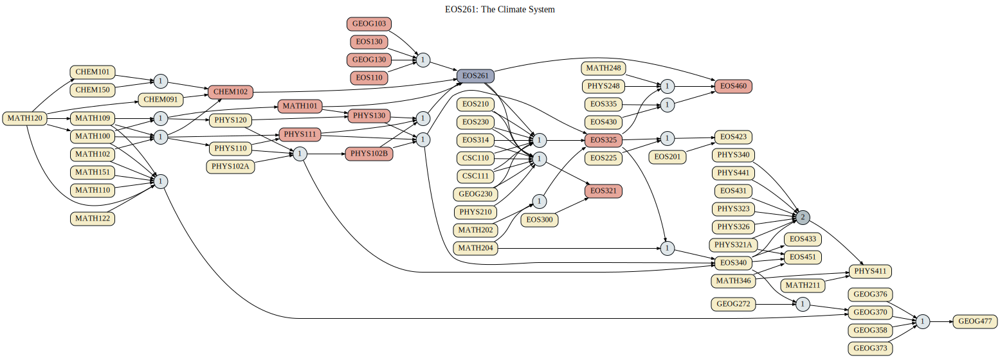

EOS261: The Climate System
*********************************

.. raw:: html

    
    
    
    

.. role:: grey
.. role:: red
.. role:: blue
.. role:: green

Pre-requisites are depicted using directional edges with an arrow that point in the direction of the course that has the pre-requisite. The color of the edge is black if the pre-req is always required. The edge is colored if there is a set of pre-req courses. The color will be  :red:`red` if the requirement is 1 of the set, :blue:`blue` if the requirement is 2 of the set, and :green:`green` if the requirement is 3 of the set. Different edge patterns, such as solid vs dashed, represent unique sets. For example, a course may have two sets of pre-reqs where only 1 course is required from each. In this example, both sets would have :red:`red` lines and one would be solid while the other is dashed.

.. Course Simplifcation Table
.. ----------------------------
.. .. raw:: html
..    :file: simplifications/simplifications.html

