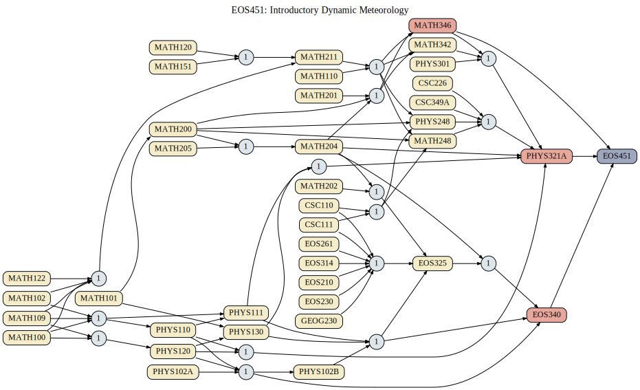

===============================
|course_short|: |course_long|
===============================

  
Circular nodes that have a numbered label indicate the number of courses required for the course on the right from the set of courses on the left. 

.. |course_short| replace:: EOS451
.. |course_long| replace:: Introductory Dynamic Meteorology

    