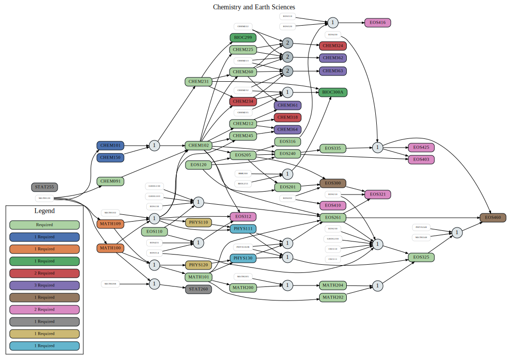

===============================
|program_long|
===============================

.. raw:: html

    
    
    
    

.. role:: grey
.. role:: red
.. role:: blue
.. role:: green

:grey:`Blue/gray nodes` are required courses in the program. Other required courses with options are separated into individually colored clusters and labeled by the number of required courses from that cluster. Extra required electives are not part of the graph. White nodes are pre-req options that are not explicitly required in the program.

  
.. |program_short| replace:: BSC-CGSC
.. |program_long| replace:: Chemistry and Earth Sciences

    