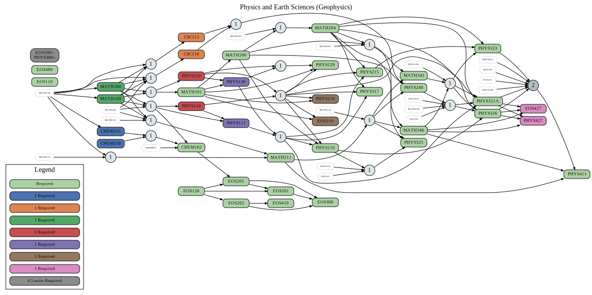
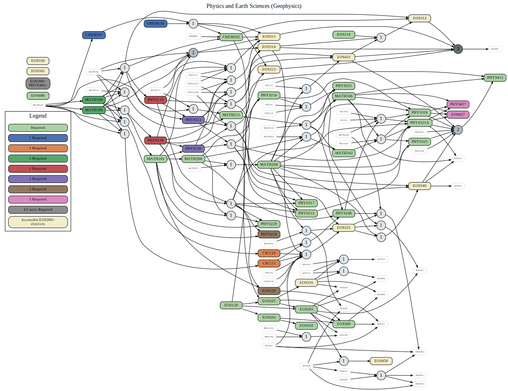

===============================
|program_long|
===============================

.. raw:: html

    
    
    
    
    
    

.. role:: grey
.. role:: red
.. role:: blue
.. role:: green
.. role:: warmyellow

:grey:`Green nodes` are required courses in the program. Required courses that are part of a set of options are colored uniquely and labeled in the legend. Extra required electives are not part of the graph. White nodes are pre-req options that are not explicitly required in the program.

Program Requirements
------------------------

  
Program Requirements and upper level EOS
----------------------------------------------------
The following graph includes all upper level EOS courses and highlights the most accessible upper level courses as :warmyellow:`colored` nodes.

  
Circular nodes that have a numbered label indicate the number of courses required for the course on the right from the set of courses on the left. 

.. |program_short| replace:: BSC-PESC
.. |program_long| replace:: Physics and Earth Sciences (Geophysics)

    